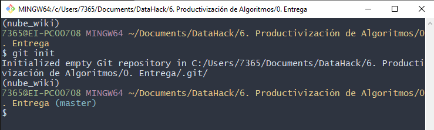
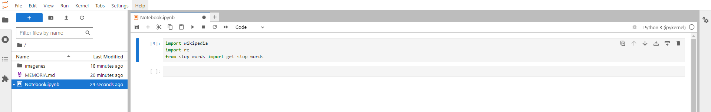
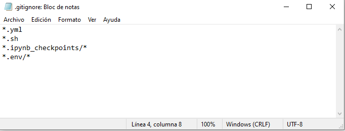
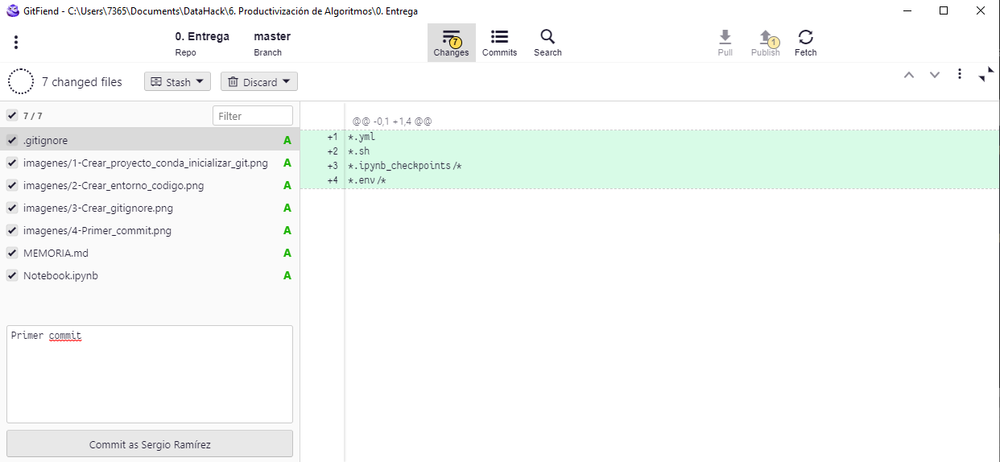
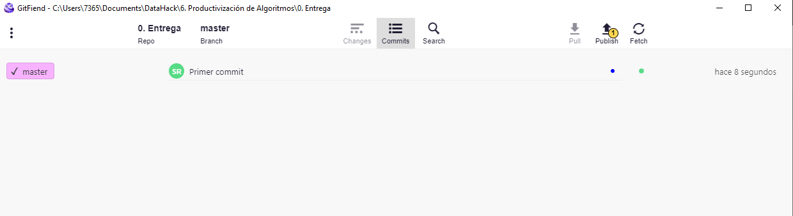
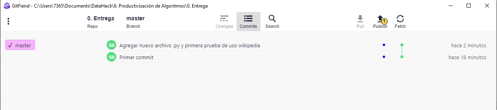
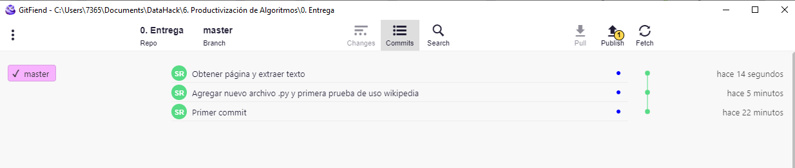

## MEMORIA EJERCICIO

Alumno: Sergio Ramírez Domínguez<br>
Fecha: 30-03-2024

**INDICE**
1. [Crear entorno git y primer commit](#id1)
2. [Añadir código y crear primera estructura Git](#id2)

### 1. Crear entorno git y primer commit <a name="id1"></a>

Creamos un proyecto conda llamado `nube_wiki` e inicializamos un proyecto git. Llamamos al repositorio `nube_wiki`.



Instalamos jupyter lab para crear nuestro entorno de código

> conda install jupyterlab



Instalamos las primeras librerías solicitadas

> conda install conda-forge::wikipedia <br>
> conda install conda-forge::stop-words

Hacemos un primer commit para agregar los archivos creados, aunque previamente, creamos el archivo `.gitignore` para no tener en nuestro repositorio archivos innecesarios:

* .gitignore



Creamos nuestro primer commit:





### 2. Añadir código y crear primera estructura Git <a name="id2"></a>

Antes de comenzar a añadir nuestro código, creamos un script para convertir nuestro notebook en un archivo Python de forma sencilla:

* convert_to_py.sh

> jupyter nbconvert --to python *.ipynb

Ahora, agregamos el código nuevo y hacemos un commit.

```
stop_words= get_stop_words('es')
len(stop_words)
print(wikipedia.languages())
                           
#fijamos el idioma a español
wikipedia.set_lang("es")
print(wikipedia.search("Python"))
print(wikipedia.search("Python", results = 3))
print(wikipedia.suggest("Madriz"))
```python



Creamos un nuevo commit con las nuevas funcionalidades:



Instalamos matplotlib y añ