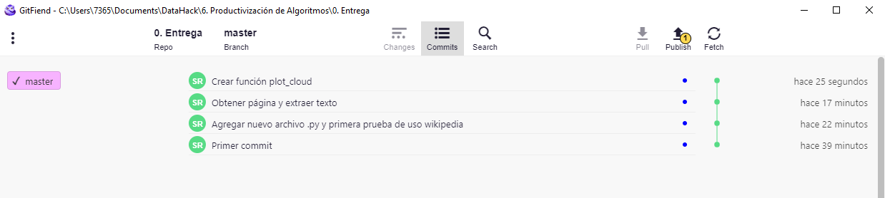
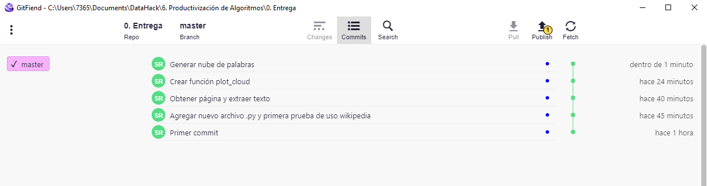
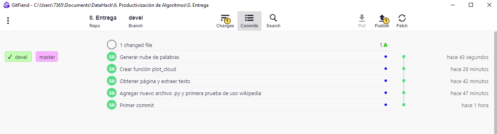
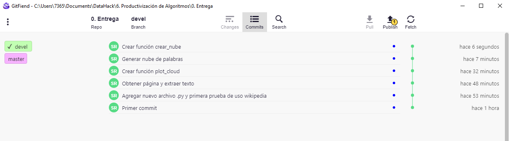
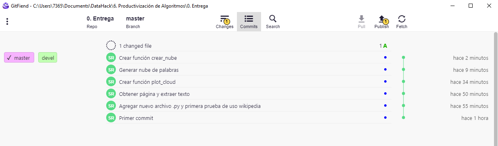
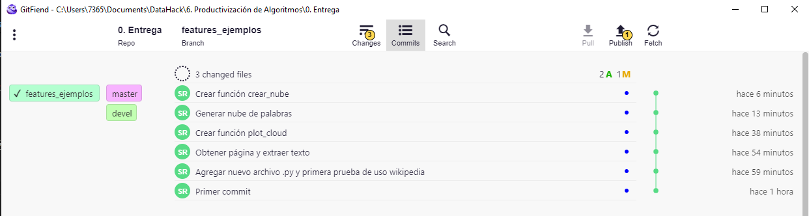

## MEMORIA EJERCICIO

Alumno: Sergio Ramírez Domínguez<br>
Fecha: 30-03-2024

**INDICE**
1. [Crear entorno git y primer commit](#id1)
2. [Añadir código y crear primera estructura Git](#id2)
3. [Crear rama devel y merge con master](#id3)
4. [Crear rama features_ejemplos](id#4)

### 1. Crear entorno git y primer commit <a name="id1"></a>

Creamos un proyecto conda llamado `nube_wiki` e inicializamos un proyecto git. Llamamos al repositorio `nube_wiki`.


Instalamos jupyter lab para crear nuestro entorno de código

> conda install jupyterlab


Instalamos las primeras librerías solicitadas

> conda install conda-forge::wikipedia <br>
> conda install conda-forge::stop-words

Hacemos un primer commit para agregar los archivos creados, aunque previamente, creamos el archivo `.gitignore` para no tener en nuestro repositorio archivos innecesarios:

* .gitignore


Creamos nuestro primer commit:


### 2. Añadir código y crear primera estructura Git <a name="id2"></a>

Antes de comenzar a añadir nuestro código, creamos un script para convertir nuestro notebook en un archivo Python de forma sencilla:

* convert_to_py.sh

> jupyter nbconvert --to python *.ipynb

Ahora, agregamos el código nuevo y hacemos un commit.

```
stop_words= get_stop_words('es')
len(stop_words)
print(wikipedia.languages())
                           
#fijamos el idioma a español
wikipedia.set_lang("es")
print(wikipedia.search("Python"))
print(wikipedia.search("Python", results = 3))
print(wikipedia.suggest("Madriz"))
```


Creamos un nuevo commit con las nuevas funcionalidades:

```
# Que página queremos descargar
wiki = wikipedia.page('Python')

# Sacamos el texto de la página
text= wiki.content

# Sacamos el texto de la página
text= wiki.content

# Cleantext
text= re.sub(r'==.*?==+', '', text) # eliminamos los headers
text= text.replace('\n', '') # eliminamos los saltos de línea
```


Instalamos `matplotlib` y añadimos el nuevo fragmento de código

> conda install matplotlib

```
import matplotlib.pyplot as plt
%matplotlib inline

# Creamos una función para generar el gráfico
def plot_cloud(wordcloud):
    # fijamos el tamaño
    plt.figure(figsize=(40, 30))
    # plotde la imagen
    plt.imshow(wordcloud)
    # sin ejes
    plt.axis("off")
```



Instalamos `wordcloud` y añadimos el nuevo fragmento de código

> conda install conda-forge::wordcloud

```
# Importamos el paquete para hacer la nube de palabras
from wordcloud import WordCloud

# Genaramos la nube
wordcloud= WordCloud(width= 3000, height= 2000, random_state=1,
                     background_color='white',colormap='viridis',
                     collocations=False, stopwords= stop_words + ["Python", "puede", "pueden"]).generate(text)
plot_cloud(wordcloud)
```




### 3. Crear rama devel y merge con master <a name="id3"></a>

Creamos la rama `devel`



Añadimos el siguiente fragmento de código

```
def crear_nube(x) :
    wikipedia.set_lang("es")
    wiki = wikipedia.page(x)

    text= wiki.content
    text= re.sub(r'==.*?==+', '', text) # eliminamos los headers
    text= text.replace('\n', '') # eliminamos los saltos de línea
    
    wordcloud= WordCloud(width= 3000, height= 2000, random_state=1,
                         background_color='white',colormap='viridis',
                         collocations=False, stopwords= stop_words+ [x]).generate(text)
    nube = plot_cloud(wordcloud)
    
    return(nube)
```

Creamos un commit en la rama `devel` con la nueva función



Hacemos un merge  un merge con `master`



### 4. Crear rama features_ejemplos <a name="id4"></a>

Creamos la rama `features_ejemplos`



Añadimos los siguientes fragmentos de código

```
crear_nube("Aranjuez")
crear_nube("Toledo")
```
